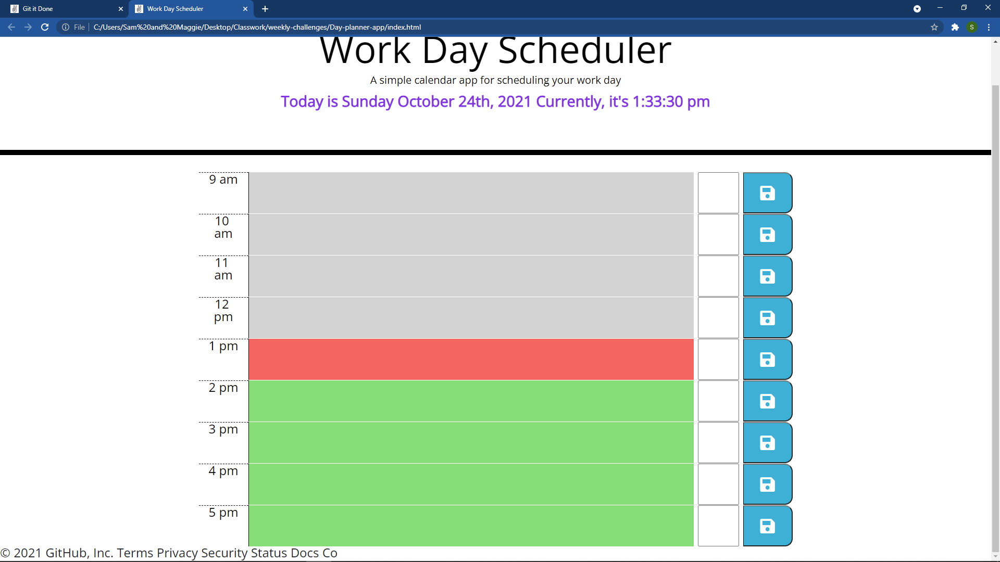

# Day-planner-app
Bootcamp challenge to create a daily planner with given html and css.

## Motivation, What I Did, and What I learned
This challenge seemed easier than my previous bootcamp challenges. I think many of the tasks are starting to repeat, and having done them several times, I'm getting more comfortable. Using the moment.js to put the times in the app was fun. I was able to load the current day and time. Through a timeout function, I made it so the time updates every second. I recieved some help from my tutor in learning how to alter the data values in the variables in order to use them in my functions. I added a checkbox to each time row, and made it so that the text is crossed out and changes color to black. So, it functions a little like a to do list as well as a scheduler, if the user desires. The button handling is getting more familiar, but still a little tricky. Saving and loading to and from localStorage seems easier, too. I wouldn't say that I've got it down completely, but I feel like things are coming along good. It is mobile responsive.

## Links
Below I have listed a link to the deployed application, and also a screenshot of how it appears in a browser.

https://steadysamwise4.github.io/Day-planner-app

